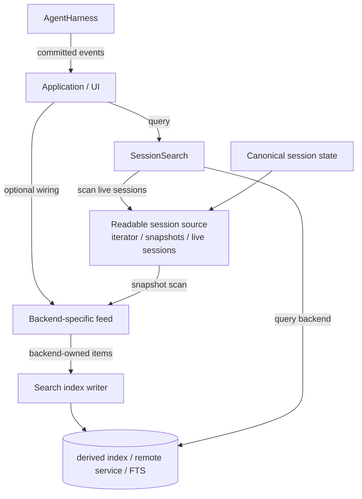

# Session search design



Search is a consumer of sessions. It is not part of `AgentHarness`, `Session`,
`SessionStorage`, or `SessionRepo` semantics. The harness writes canonical session
state and reports committed facts. Applications decide whether and how to connect
those facts to a search service.

## Fit with harness v2

This design relies on the harness v2 boundaries rather than extending them:

- The searchable source of truth is the passive, append-only session tree. Search
  indexes entries or projections of entries; lane operation records remain
  orchestration/recovery state, not normal searchable conversation content.
- Harness events are passive, live-only, and fire after commit. They may drive
  near-real-time indexing, but durable indexing cannot depend on event replay;
  catch-up/rebuild must read committed session state.
- `SessionRepo.open()` is a writer/ownership operation for backends such as
  SQLite. Generic scanning/feed must consume readable session views or backend
  snapshots, not open sessions through the repository just to search.
- Search indexes are derived state. Index writes and failures are outside harness
  recovery and must not add operation-log states or storage invariants.
- The serving/application layer owns freshness, leases, batching, remote index
  auth, and stale-hit handling. The harness remains responsible only for durable
  session execution.

# 1. Goals

- **Search outside the repo.** A repository locates and opens sessions. It does
  not own search, expose `search()`, or maintain indexes as part of canonical
  writes.
- **Search outside the harness.** A harness executes one session and emits events.
  It does not know which search backend exists, whether indexing is synchronous,
  or whether indexing exists at all.
- **Two built-in search styles.**
  1. Scanning search: non-indexed search over a search-shaped source. Built-in
     sources/adapters cover JSONL and memory.
  2. SQLite FTS search: an indexed/materialized backend over canonical SQLite
     tables. It is still a search service, not a repository capability.
- **Query is the common abstraction.** All search backends implement
  `SessionSearch`. The query caller does not know whether the backend scans,
  queries SQLite FTS, calls Elasticsearch, or delegates to an app-owned service.
- **Index feeds are backend-owned.** Indexed search backends may expose a writer,
  but the item shape is not universal. A document-oriented backend can receive
  projected documents; SQLite FTS can receive entry references or rebuild from
  SQLite `entries`; a remote service can receive whatever its adapter declares.
- **Remote and arbitrary backends.** Search must be easy to place anywhere and
  mix with any canonical storage: JSONL sessions with a local SQLite index,
  SQLite sessions with remote Elasticsearch/OpenSearch, a custom Postgres session
  backend with a user-owned Elastic adapter, or memory sessions with an
  in-process test index. The connection is source/feed/query interfaces, not a
  particular repo type, shared process memory, or co-located storage.
- **Indexes are derived state.** Search indexes may be deleted and rebuilt from
  canonical sessions. Index failures must not corrupt sessions or affect recovery.
- **Application-owned consistency.** The application chooses live listeners,
  snapshot catch-up, batching, retry policy, and whether a query may return stale
  index results.

## Non-goals

- **No universal ranking contract.** Backends may use substring matching, FTS,
  BM25, embeddings, or custom ranking. The common contract only defines hit
  identity and enough metadata for the app to open/display a result.
- **No universal index document contract.** Search documents are a convenience for
  document-oriented indexes, not the indexing abstraction. Backends may index
  canonical rows, entry ids, projected documents, embeddings, or remote records.
- **No exactly-once external indexing.** Feed delivery is normally at-least-once.
  Feed items should be idempotent for the backend that consumes them. Cursor or
  checkpoint writes make replays safe.
- **No mandated live indexing.** An application may only scan on demand, rebuild
  periodically, or wire harness events for near-real-time indexing.
- **No storage coupling.** Canonical session writes do not depend on search-index
  writes. If an app deliberately wants transactional co-location for one backend,
  that is a backend/app policy, not a harness/repo invariant.

# 2. Concepts

## Canonical state

Canonical state is the durable session data defined by the harness design:
entries, lane records, lanes, facts, and stats. Search only indexes or scans a
projection of that data. The session remains complete and valid if all search
state is removed.

## Scanning source

A scanning source exposes a **search projection**, not `SessionStorage`. Storage
methods such as `findEntries()`, `getName()`, or `getLabel()` may be convenient
inside a backend adapter, but they are not the shared search contract and are not
assumed to be optimal for search.

```ts
interface SessionSearchCandidate {
  entryId: string;
  seq: number;
  timestamp: number;
  text: string;
  fields?: Record<string, unknown>;
}

interface ScanningSession<TMetadata extends SessionMetadata = SessionMetadata> {
  metadata(): Promise<TMetadata>;
  entries(options?: { afterSeq?: number; limit?: number }):
    Iterable<SessionSearchCandidate> | AsyncIterable<SessionSearchCandidate>;
}

interface ScanningSessionSource<TMetadata extends SessionMetadata = SessionMetadata, TOptions = unknown> {
  sessions(options?: TOptions): Iterable<ScanningSession<TMetadata>>
    | AsyncIterable<ScanningSession<TMetadata>>;
}

interface ScanningSessionSearchOptions<TMetadata, TOptions> {
  sourceOptions?: (query: SessionSearchOptions) => TOptions | undefined;
  match?: (queryText: string, candidate: SessionSearchCandidate, metadata: TMetadata) => boolean;
  score?: (queryText: string, candidate: SessionSearchCandidate, metadata: TMetadata) => number | undefined;
}
```

The source is deliberately an iterator of projected searchable sessions, not
`list()` + `repo.open()`. For backends such as SQLite, `repo.open()` claims the
session's writer lease; scanning search is read-only and must not accidentally
compete with the harness/app that already owns that writer. The
application/backend decides how to produce projected views safely: JSONL can adapt
its storage loader, memory can wrap live sessions, a remote backend can stream
search candidates from an API, and a custom backend can use whatever read path is
optimal.

## Search backend

A query backend implements:

```ts
interface SessionSearch<TMetadata extends SessionMetadata = SessionMetadata> {
  search(options: SessionSearchOptions): Promise<SessionSearchHit<TMetadata>[]>;
}
```

This is the only universal search contract.

## Search index writer

An indexed backend may additionally expose a writer. The common writer contract
only says "apply some backend-owned items" and optionally "flush pending work":

```ts
interface SearchIndexWriter<TItem = unknown> {
  apply(items: TItem[]): Promise<void>;
  flush?(): Promise<void>;
}

interface IndexedSessionSearch<TMetadata extends SessionMetadata = SessionMetadata, TItem = unknown>
  extends SessionSearch<TMetadata>, SearchIndexWriter<TItem> {}
```

The important point is `TItem`: pi does not declare universal feed commands or a
universal document/update shape. Each indexed backend owns its own item type.

Examples:

```ts
type ElasticFeedItem =
  | { type: "upsert"; id: string; body: Record<string, unknown> }
  | { type: "delete"; id: string };

type SqliteSessionSearchFeedItem =
  | { type: "rebuild" }
  | { type: "index_session"; sessionId: string }
  | { type: "index_entry"; sessionId: string; entryId: string }
  | { type: "delete_session"; sessionId: string }
  | { type: "delete_entry"; sessionId: string; entryId: string };
```

# 3. Query surface

Every search backend implements the query-only surface:

```ts
interface SessionSearchOptions {
  text: string;
  cwd?: string;
  limit?: number;
}

interface SessionSearchHit<TMetadata extends SessionMetadata = SessionMetadata> {
  metadata: TMetadata;
  entryId: string;
  timestamp: number;
  snippet?: string;
  score?: number;
}
```

- `text` is the query.
- `cwd` is a conventional workspace filter because current JSONL and SQLite
  metadata carry it.
- `limit` bounds result count.

Backends may support richer backend-specific options separately. The common
interface stays small.

# 4. Built-in backends

## 4.1 Scanning search

Scanning search receives a `ScanningSessionSource`, iterates projected candidates,
and applies common matching/limit behavior in memory. The scanner does not know
about `SessionStorage` or repository APIs.

```ts
const search = createScanningSessionSearch(source);
```

Built-in source adapters can be layered on top:

```ts
const jsonlSearch = createJsonlScanningSessionSearch({ fs, sessionsRoot });
const memorySearch = createMemoryScanningSessionSearch([session]);
```

Properties:

- No persistent index.
- No `apply()` and no index writes.
- Always reflects whatever the source returns at query time.
- Matching behavior is shared; backend-specific code owns reading/projection.
- JSONL and memory can use storage methods internally, but that coupling stays in
  their adapters rather than in the shared search type.
- Slow for large collections; acceptable as a default/fallback.

Scanning search proves search can be expressed over projected readable views
without extending the repository contract or acquiring writer leases.

## 4.2 SQLite FTS search

SQLite FTS search is the built-in indexed/materialized implementation. It does
not participate in the scanning-source abstraction. It implements
`IndexedSessionSearch<SqliteSessionMetadata, SqliteSessionSearchFeedItem>` and
queries a materialized FTS table. It can use FTS5 directly over canonical SQLite
`entries`:

```sql
CREATE VIRTUAL TABLE session_search_fts USING fts5(
  payload,
  content = 'entries',
  content_rowid = 'rowid',
  tokenize = 'trigram remove_diacritics 1'
);
```

Then queries join back to canonical rows:

```sql
FROM session_search_fts
JOIN entries ON entries.rowid = session_search_fts.rowid
JOIN sessions ON sessions.id = entries.session_id
WHERE session_search_fts MATCH ?
```

No `session_search_documents` table is required. The FTS index can be virtualized
over canonical rows because that is the natural SQLite implementation.

The boundary is still architectural, not necessarily physical:

- The repository does not expose `search()`.
- The harness does not prescribe indexing.
- The SQLite search adapter owns the FTS schema and its backend-specific feed
  commands.
- Canonical SQLite writes update `sessions`/`entries`; FTS is derived state and is
  updated by explicit `apply(...)` calls such as `index_entry` or `rebuild`.

## 4.3 Index maintenance policy

There are two ways to keep an index current.

**Database-side triggers:** the canonical database automatically updates the index
when canonical tables change.

```text
INSERT INTO entries
  -> SQLite trigger inserts/updates session_search_fts
```

This is simple and fresh for co-located cases like SQLite `entries` + SQLite FTS
or Postgres rows + Postgres full-text indexes. But it does not abstract over
mixed backends: JSONL + SQLite FTS, SQLite + remote Elasticsearch, or custom
Postgres + hosted search still need application/adaptor plumbing. It can also put
search-index failures in the canonical write failure path.

**Explicit feed/catch-up:** canonical storage writes first; application/search
adapter code updates the index from committed entries or snapshots.

```text
Session source / committed event
  -> project backend-specific item
  -> SearchIndexWriter.apply(...)
```

This is the shared design choice. It is more abstractable because the connector
sits above both systems and works for any storage/search combination. Search may
be stale until feed/catch-up runs, but canonical session correctness and recovery
remain independent from the index.

Triggers remain allowed as a backend-specific optimization for a co-located search
adapter. They are not the common abstraction.

# 5. Projection

Projection belongs to the source or indexed backend adapter. A scanning source
projects canonical state into `SessionSearchCandidate` values with text ready for
matching. An indexed backend adapter projects committed state into its own
`TItem` feed commands.

For JSONL scanning, the adapter may use `JsonlSessionStorage` internally:

```ts
export async function* jsonlScanningSessions(options, query = {}) {
  for await (const storage of jsonlSearchSessions(options, query)) {
    yield {
      metadata: () => storage.getMetadata(),
      async *entries({ limit = 100, afterSeq = 0 } = {}) {
        while (true) {
          const entries = await storage.findEntries({
            order: "oldestFirst",
            limit,
            cursor: { afterSeq },
          });
          if (entries.length === 0) break;

          for (const entry of entries) {
            const label = await storage.getLabel(entry.id);
            yield {
              entryId: entry.id,
              seq: entry.seq,
              timestamp: entry.timestamp,
              text: JSON.stringify(entry) + (label ? ` ${label}` : ""),
              fields: label === undefined ? undefined : { label },
            };
          }

          afterSeq = entries[entries.length - 1].seq;
        }
      },
    };
  }
}
```

That reuse is JSONL-specific. The shared search API does not require every
backend to expose `findEntries()`, labels, names, or any storage-shaped methods.

# 6. Feeding indexes

Feeding is application-owned and backend-specific. The common API only provides
`SearchIndexWriter<TItem>.apply(items)`. The item type is declared by the backend
or by the application adapter.

SQLite declares its own feed items, for example:

```ts
await sqliteSearch.apply([{ type: "index_entry", sessionId, entryId }]);
await sqliteSearch.apply([{ type: "rebuild" }]);
```

A remote index would declare different items:

```ts
type ElasticItem = { type: "upsert"; id: string; body: unknown };
await elastic.apply([{ type: "upsert", id, body }]);
```

Snapshot/catch-up loops are ordinary application/adapter code. They may read
JSONL via the JSONL scanning source, read SQLite canonical tables directly, or use
a backend-specific API.

Live indexing is also application-owned:

```ts
harness.events.on("entry", async (event) => {
  await index.apply([projectBackendItem(sessionMetadata, event.entry)]);
});
```

Exact event names are defined by the harness event API; the search design only
requires that the application uses events that fire after canonical commit. If the
process dies after the canonical write but before indexing, snapshot catch-up can
repair the index.

# 7. Consistency and crash behavior

Search indexing is derived-state maintenance. The safe default is at-least-once
feed plus idempotent backend writes.

Checkpoint rule:

> Apply index writes first, then advance the checkpoint.

Crash cases:

| Crash site | Durable state | Recovery |
|---|---|---|
| Before index write | Canonical session is ahead of index | Catch-up reads after checkpoint and re-feeds |
| After index write, before checkpoint | Index may contain duplicate-applied item | Catch-up applies same item again |
| After checkpoint | Index and checkpoint agree | No replay needed |

If the index and checkpoint are in the same database, they may be committed in one
transaction. If not, writing the checkpoint after index acknowledgement preserves
at-least-once safety.

The common `SessionSearch` result does not promise that an indexed backend is
fully current with canonical sessions. For SQLite FTS, results reflect the most
recent successful `apply(...)`/`rebuild`, not merely the most recent canonical
write. Applications that need freshness can:

- perform catch-up before query,
- display an "indexing" state,
- fall back to scanning for recent sessions,
- or expose backend-specific freshness metadata.

Scanning search is current with its source at query time and has no checkpoint.

# 8. Deletes, forks, and metadata updates

## Session delete

An indexed backend decides its delete item shape. A document-oriented index might
use:

```ts
{ type: "session_delete", sessionId }
```

A SQLite FTS adapter might delete all FTS rows whose canonical `entries.session_id`
matches, or simply join FTS hits back to canonical `sessions`/`entries` so stale
FTS rowids are suppressed. A remote backend might call a delete-by-query API.
Scanning search naturally stops returning deleted sessions because the source no
longer lists them.

Recommended ordering for indexed search:

```ts
await repo.delete(metadata);                 // source of truth first
await index.apply([{ type: "delete_session", sessionId: metadata.id }]);
```

If index cleanup fails, canonical deletion still succeeded. The app should retry
cleanup later. It may also validate a hit when the user opens it and show
"session no longer exists" if the canonical session or entry is gone.

## Entry delete

Harness v2 entries are append-only, so normal session operation does not delete
entries. Entry-delete feed exists only for backends/importers/admin repair flows
that need incremental index cleanup.

## Fork

A fork creates a new session with copied entries. Search treats forked entries as
new searchable items under the fork session id. Even when entry ids are preserved
by a backend, hit identity includes session metadata plus entry id, so source and
fork hits are separate.

## Session name and labels

Name and labels are global facts, not entries. Applications choose how searchable
they are:

- update session-level metadata in an index;
- denormalize current name into future entry documents;
- rebuild/update existing indexed items for a session when the name changes;
- ignore labels and names for search.

The harness should not prescribe this because UI search semantics differ by app.
A scanning source may include names/labels in its projected candidate text or
fields. JSONL can do this inside its adapter by calling the public JSONL storage
reads after loading sessions read-only. Indexed backends should represent
name/label updates with their own feed item shapes if they want those facts to be
searchable.

# 9. Error isolation

Canonical writes and search writes have different failure domains.

- A failed canonical session write faults the harness/session as defined by the
  harness design.
- A failed index write does not make the session invalid and does not participate
  in recovery.
- Applications may retry index writes, mark the index stale, or disable search.
- If an application chooses synchronous indexing before acknowledging a UI action,
  the UI action may fail at the application layer, but the canonical session write
  remains governed only by session storage rules.

This separation prevents search from becoming storage handling.

# 10. Adding custom backends

## Custom session backend

Implement `SessionRepo` for canonical lifecycle. Do not make scanning search call
`repo.open()` for every result: in writer-lease backends, `open()` may mean
"claim the writer". Instead, expose a separate projected scanning source when you
want non-indexed search:

```ts
class PostgresSessionRepo implements SessionRepo<PostgresMetadata, CreateOptions, ListOptions> {
  create(options) { /* ... */ }
  open(metadata) { /* open for canonical session ownership */ }
  list(options) { /* return metadata[] */ }
  delete(metadata) { /* ... */ }
  fork(source, options) { /* ... */ }
}

const source = {
  async *sessions(options?: ListOptions) {
    for (const row of await postgres.listReadableSessions(options)) {
      yield {
        metadata: async () => row.metadata,
        async *entries({ afterSeq = 0, limit = 100 } = {}) {
          for (const entry of await postgres.readSearchEntries(row.id, { afterSeq, limit })) {
            yield {
              entryId: entry.id,
              seq: entry.seq,
              timestamp: entry.timestamp,
              text: entry.searchText,
              fields: entry.fields,
            };
          }
        },
      };
    }
  },
};

const scanSearch = createScanningSessionSearch(source);
```

No `search()` method is added to the repo.

For JSONL, the packaged source lives in the search module and is just the small
loop over public JSONL listing/deserialization helpers from the JSONL session module:

```ts
for (const metadata of await listJsonlSessionMetadata({ fs, sessionsRoot }, { cwd })) {
  yield loadJsonlSessionStorage({ fs, sessionsRoot }, metadata);
}
```

The JSONL scanning adapter may reuse those helpers internally, then project
`JsonlSessionStorage` into scanning candidates. This preserves the useful JSONL
behavior — enumerate/load readable session files without `repo.open()` — while
keeping the shared scanning interface decoupled from `SessionStorage`.

## Custom search backend

Implement only query if the backend owns its own data or scans remotely:

```ts
class MySearch implements SessionSearch<MyMetadata> {
  async search(options) {
    return remote.query(options); // returns { metadata, entryId, timestamp, ... }[]
  }
}
```

If it is indexed, choose your own feed item type:

```ts
type ElasticItem =
  | { type: "upsert"; id: string; body: unknown }
  | { type: "delete_session"; sessionId: string };

class ElasticSessionSearch implements IndexedSessionSearch<MyMetadata, ElasticItem> {
  async apply(items: ElasticItem[]) { /* bulk index/delete */ }
  async search(options: SessionSearchOptions) { /* query elastic */ }
}
```

Wire canonical sessions to that backend at app level with whatever projection
that backend wants. The projection does not need to use the scanning-source
interface; it can read canonical state through any safe backend-specific path.

## Example: JSONL sessions with a remote Elasticsearch index

This is the shape an application adapter would own. The core search API only
provides `SessionSearch` and `IndexedSessionSearch<TMetadata, TItem>`; the Elastic
item type and document shape are local to the adapter.

```ts
import { Client } from "@elastic/elasticsearch";
import {
  createJsonlScanningSessionSource,
  type IndexedSessionSearch,
  type JsonlSessionMetadata,
  type JsonlSessionRepoOptions,
  type SessionSearchHit,
  type SessionSearchOptions,
} from "@earendil-works/pi-agent-core";

type ElasticSessionFeedItem =
  | { type: "upsert"; id: string; body: ElasticSessionDoc }
  | { type: "delete"; id: string };

interface ElasticSessionDoc {
  sessionId: string;
  entryId: string;
  seq: number;
  timestamp: number;
  cwd: string;
  text: string;
  metadata: JsonlSessionMetadata;
  fields?: Record<string, unknown>;
}

class ElasticSessionSearch
  implements IndexedSessionSearch<JsonlSessionMetadata, ElasticSessionFeedItem>
{
  constructor(
    private readonly client: Client,
    private readonly index: string,
  ) {}

  async apply(items: ElasticSessionFeedItem[]): Promise<void> {
    const operations = items.flatMap((item) => {
      if (item.type === "delete") {
        return [{ delete: { _index: this.index, _id: item.id } }];
      }
      return [{ index: { _index: this.index, _id: item.id } }, item.body];
    });

    if (operations.length > 0) await this.client.bulk({ operations });
  }

  async flush(): Promise<void> {
    await this.client.indices.refresh({ index: this.index });
  }

  async search(options: SessionSearchOptions): Promise<SessionSearchHit<JsonlSessionMetadata>[]> {
    const result = await this.client.search<ElasticSessionDoc>({
      index: this.index,
      size: options.limit ?? 20,
      query: {
        bool: {
          must: [{ match: { text: options.text } }],
          filter: options.cwd === undefined ? [] : [{ term: { cwd: options.cwd } }],
        },
      },
    });

    return result.hits.hits.flatMap((hit) => {
      if (!hit._source) return [];
      return [{
        metadata: hit._source.metadata,
        entryId: hit._source.entryId,
        timestamp: hit._source.timestamp,
        snippet: hit._source.text,
        score: hit._score ?? undefined,
      }];
    });
  }
}
```

A catch-up/rebuild job connects JSONL's read-only scanning source to the Elastic
adapter. It never calls `repo.open()`:

```ts
async function indexJsonlSessionsIntoElastic(
  jsonl: JsonlSessionRepoOptions,
  elastic: ElasticSessionSearch,
  options: { cwd?: string } = {},
): Promise<void> {
  const source = createJsonlScanningSessionSource(jsonl);

  for await (const session of source.sessions({ cwd: options.cwd })) {
    const metadata = await session.metadata();
    for await (const candidate of session.entries()) {
      await elastic.apply([{
        type: "upsert",
        id: `${metadata.id}:${candidate.entryId}`,
        body: {
          sessionId: metadata.id,
          entryId: candidate.entryId,
          seq: candidate.seq,
          timestamp: candidate.timestamp,
          cwd: metadata.cwd,
          text: candidate.text,
          metadata,
          fields: candidate.fields,
        },
      }]);
    }
  }

  await elastic.flush();
}
```

Deletion and freshness policy remain application-owned. For example, after a
canonical JSONL session delete, the app could enqueue one or more
`{ type: "delete", id }` items, or periodically rebuild the remote index from the
JSONL source.

# 11. Package placement

`src/search/index.ts` stays the high-level public surface and re-exports the
built-ins. Implementation-specific pieces live in sibling modules:

- `src/search/scanning.ts` — generic scanner and projected source types.
- `src/search/jsonl.ts` — JSONL read-only scanning adapter.
- `src/search/memory.ts` — memory/already-owned-session scanning adapter.
- `src/search/indexable.ts` — indexed-search writer contracts.

The shared agent package exports the small query/index types plus the generic
scanner over projected search sources:

```ts
export type { SessionSearch, SessionSearchHit, SessionSearchOptions };
export type { SearchIndexWriter, IndexedSessionSearch };
export type { SessionSearchCandidate, ScanningSession, ScanningSessionSource };
export type { ScanningSessionSearchOptions };
export { createScanningSessionSearch };
```

JSONL-specific scanning helpers live with the search JSONL adapter and may reuse
public JSONL listing/loading helpers:

```ts
export { createJsonlScanningSessionSource, createJsonlScanningSessionSearch, jsonlScanningSessions };
```

Memory can provide a small adapter for already-owned sessions/storages:

```ts
export { createMemoryScanningSessionSource, createMemoryScanningSessionSearch, memoryScanningSessions };
```

The SQLite package exports its FTS implementation:

```ts
export { createSqliteSessionSearch };
```

Neither package requires `SessionRepo` to grow a search method. Scanning search
consumes projected search sources; indexed search consumes backend-owned feed
items. `repo.open()` is not assumed to be a read-only operation.

# 12. Summary

Search has three independent pieces:

1. **Scanning source** — a projected read path for non-indexed search. JSONL and
   memory can provide built-in adapters; custom backends can provide their own. It
   is not `repo.open()` unless that operation is known to be read-only for the
   backend.
2. **Indexed feed** — optional connection from canonical state to an indexed
   backend. The feed item shape belongs to the backend; core only provides
   `apply()`/`flush()`.
3. **Query backend** — either scans projected candidates directly or queries a
   derived index such as SQLite FTS, Elasticsearch, Postgres full-text search, or
   a hosted app service.

The boundary is explicit: canonical sessions produce durable state;
applications/adapters project that state for scanning or feed backend-owned items
to indexes; query callers only see `SessionSearch`.
