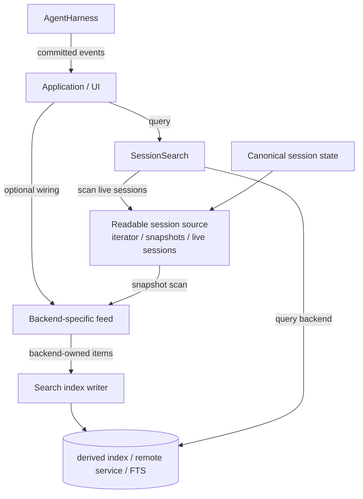

# Session search design



Search is a consumer of sessions. It is not part of `AgentHarness`, `Session`,
`SessionStorage`, or `SessionRepo` semantics. The harness writes canonical session
state and reports committed facts. Applications decide whether and how to connect
those facts to a search service.

## Fit with harness v2

This design relies on the harness v2 boundaries rather than extending them:

- The searchable source of truth is the passive, append-only session tree. Search
  indexes entries or projections of entries; lane operation records remain
  orchestration/recovery state, not normal searchable conversation content.
- Harness events are passive, live-only, and fire after commit. They may drive
  near-real-time indexing, but durable indexing cannot depend on event replay;
  catch-up/rebuild must read committed session state.
- `SessionRepo.open()` is a writer/ownership operation for backends such as
  SQLite. Generic scanning/feed must consume readable session views or backend
  snapshots, not open sessions through the repository just to search.
- Search indexes are derived state. Index writes and failures are outside harness
  recovery and must not add operation-log states or storage invariants.
- The serving/application layer owns freshness, leases, batching, remote index
  auth, and stale-hit handling. The harness remains responsible only for durable
  session execution.

# 1. Goals

- **Search outside the repo.** A repository locates and opens sessions. It does
  not own search, expose `search()`, or maintain indexes as part of canonical
  writes.
- **Search outside the harness.** A harness executes one session and emits events.
  It does not know which search backend exists, whether indexing is synchronous,
  or whether indexing exists at all.
- **Two built-in search styles.**
  1. A scanning implementation over a supplied list/source of sessions. This
     works for JSONL, memory, tests, and custom collections.
  2. A SQLite FTS implementation. It may use FTS5 directly over canonical SQLite
     `entries`. It is still a search service, not a repository capability.
- **Query is the common abstraction.** All search backends implement
  `SessionSearch`. The query caller does not know whether the backend scans,
  queries SQLite FTS, calls Elasticsearch, or delegates to an app-owned service.
- **Index feeds are backend-owned.** Indexed search backends may expose a writer,
  but the item shape is not universal. A document-oriented backend can receive
  projected documents; SQLite FTS can receive entry references or rebuild from
  SQLite `entries`; a remote service can receive whatever its adapter declares.
- **Remote and arbitrary backends.** Search must be easy to place anywhere and
  mix with any canonical storage: JSONL sessions with a local SQLite index,
  SQLite sessions with remote Elasticsearch/OpenSearch, a custom Postgres session
  backend with a user-owned Elastic adapter, or memory sessions with an
  in-process test index. The connection is source/feed/query interfaces, not a
  particular repo type, shared process memory, or co-located storage.
- **Indexes are derived state.** Search indexes may be deleted and rebuilt from
  canonical sessions. Index failures must not corrupt sessions or affect recovery.
- **Application-owned consistency.** The application chooses live listeners,
  snapshot catch-up, batching, retry policy, and whether a query may return stale
  index results.

## Non-goals

- **No universal ranking contract.** Backends may use substring matching, FTS,
  BM25, embeddings, or custom ranking. The common contract only defines hit
  identity and enough metadata for the app to open/display a result.
- **No universal index document contract.** Search documents are a convenience for
  document-oriented indexes, not the indexing abstraction. Backends may index
  canonical rows, entry ids, projected documents, embeddings, or remote records.
- **No exactly-once external indexing.** Feed delivery is normally at-least-once.
  Feed items should be idempotent for the backend that consumes them. Cursor or
  checkpoint writes make replays safe.
- **No mandated live indexing.** An application may only scan on demand, rebuild
  periodically, or wire harness events for near-real-time indexing.
- **No storage coupling.** Canonical session writes do not depend on search-index
  writes. If an app deliberately wants transactional co-location for one backend,
  that is a backend/app policy, not a harness/repo invariant.

# 2. Concepts

## Canonical state

Canonical state is the durable session data defined by the harness design:
entries, lane records, lanes, facts, and stats. Search only indexes or scans a
projection of that data. The session remains complete and valid if all search
state is removed.

## Search source

A search source is anything that can expose **readable session views** to search
code:

```ts
type SessionSearchReadable<TMetadata extends SessionMetadata = SessionMetadata> = Pick<
  SessionStorage<TMetadata>,
  "getMetadata" | "findEntries"
>;

interface SessionSearchSource<TMetadata extends SessionMetadata = SessionMetadata, TOptions = unknown> {
  sessions(options?: TOptions): Iterable<SessionSearchReadable<TMetadata>>
    | AsyncIterable<SessionSearchReadable<TMetadata>>;
}
```

The source is deliberately an iterator of readable sessions, not `list()` +
`repo.open()`. For backends such as SQLite, `repo.open()` claims the session's
writer lease; scanning search is read-only and must not accidentally compete with
the harness/app that already owns that writer. The application/backend decides how
to produce readable views safely: already-open sessions, read-only snapshots, a
remote API, or a backend-specific read iterator.

## Search backend

A query backend implements:

```ts
interface SessionSearch<TMetadata extends SessionMetadata = SessionMetadata> {
  search(options: SessionSearchOptions): Promise<SessionSearchHit<TMetadata>[]>;
}
```

This is the only universal search contract.

## Search index writer

An indexed backend may additionally expose a writer. The writer is generic over
its feed item type:

```ts
interface SearchIndexWriter<TItem = unknown> {
  apply(items: TItem[]): Promise<void>;
  flush?(): Promise<void>;
}

interface IndexedSessionSearch<TMetadata extends SessionMetadata = SessionMetadata, TItem = unknown>
  extends SessionSearch<TMetadata>, SearchIndexWriter<TItem> {}
```

The important point is `TItem`: pi does not prescribe the indexed shape.

Examples:

```ts
// A document-oriented remote index.
type ElasticFeedItem = { type: "upsert"; id: string; body: Record<string, unknown> };

// A SQLite FTS adapter over canonical SQLite entries.
type SqliteFtsFeedItem = { type: "index_entry"; sessionId: string; entryId: string };

// A backend that rebuilds by reading its own canonical tables may not need a
// public item type at all; it can expose rebuild/catch-up methods of its own.
```

# 3. Query surface

Every search backend implements the query-only surface:

```ts
interface SessionSearchOptions {
  text: string;
  cwd?: string;
  limit?: number;
}

interface SessionSearchHit<TMetadata extends SessionMetadata = SessionMetadata> {
  metadata: TMetadata;
  entryId: string;
  timestamp: string;
  snippet?: string;
  score?: number;
}
```

- `text` is the query.
- `cwd` is a conventional workspace filter because current JSONL and SQLite
  metadata carry it.
- `limit` bounds result count.

Backends may support richer backend-specific options separately. The common
interface stays small.

# 4. Built-in backends

## 4.1 Scanning search

Scanning search receives a `SessionSearchSource`, iterates readable sessions,
reads entries, and filters in memory.

```ts
const source = createSessionListSearchSource([alreadyOpenSession]);
const search = createScanningSessionSearch(source);
```

A backend can also provide its own read-only iterator:

```ts
const source = {
  async *sessions({ cwd }) {
    yield* sqliteReadOnlySessionSnapshots({ cwd });
  },
};
```

Properties:

- No persistent index.
- No feed and no index writes.
- Always reflects whatever the source returns at query time.
- Works for memory, JSONL, SQLite, tests, and custom sources.
- Slow for large collections; acceptable as a default/fallback.

Scanning search proves search can be expressed over readable session views without
extending the repository contract or acquiring writer leases.

## 4.2 SQLite FTS search

SQLite FTS search is a backend-specific indexed search implementation. It can use
FTS5 directly over canonical SQLite `entries`:

```sql
CREATE VIRTUAL TABLE session_search_fts USING fts5(
  payload,
  content = 'entries',
  content_rowid = 'rowid',
  tokenize = 'trigram remove_diacritics 1'
);
```

Then queries join back to canonical rows:

```sql
FROM session_search_fts
JOIN entries ON entries.rowid = session_search_fts.rowid
JOIN sessions ON sessions.id = entries.session_id
WHERE session_search_fts MATCH ?
```

No `session_search_documents` table is required. The FTS index can be virtualized
over canonical rows because that is the natural SQLite implementation.

The boundary is still architectural, not necessarily physical:

- The repository does not expose `search()`.
- The harness does not prescribe indexing.
- The SQLite search adapter owns any FTS schema, rebuild, trigger, or catch-up
  policy.

## 4.3 Index maintenance policy

There are two ways to keep an index current.

**Database-side triggers:** the canonical database automatically updates the index
when canonical tables change.

```text
INSERT INTO entries
  -> SQLite trigger inserts/updates session_search_fts
```

This is simple and fresh for co-located cases like SQLite `entries` + SQLite FTS
or Postgres rows + Postgres full-text indexes. But it does not abstract over
mixed backends: JSONL + SQLite FTS, SQLite + remote Elasticsearch, or custom
Postgres + hosted search still need application/adaptor plumbing. It can also put
search-index failures in the canonical write failure path.

**Explicit feed/catch-up:** canonical storage writes first; application/search
adapter code updates the index from committed entries or snapshots.

```text
Session source / committed event
  -> project backend-specific item
  -> SearchIndexWriter.apply(...)
```

This is the shared design choice. It is more abstractable because the connector
sits above both systems and works for any storage/search combination. Search may
be stale until feed/catch-up runs, but canonical session correctness and recovery
remain independent from the index.

Triggers remain allowed as a backend-specific optimization for a co-located search
adapter. They are not the common abstraction.

# 5. Optional document utilities

Document-oriented indexes are common, especially remote ones. For those, pi
provides optional document helpers:

```ts
interface SessionSearchDocument<TMetadata extends SessionMetadata = SessionMetadata> {
  sessionId: string;
  entryId: string;
  seq: number;
  timestamp: number;
  metadata: TMetadata;
  text: string;
  fields?: Record<string, string | number | boolean | null>;
}

type SessionSearchDocumentFeedItem<TMetadata extends SessionMetadata = SessionMetadata> =
  | { type: "entry_upsert"; document: SessionSearchDocument<TMetadata> }
  | { type: "entry_delete"; sessionId: string; entryId: string }
  | { type: "session_delete"; sessionId: string }
  | { type: "session_metadata"; sessionId: string; metadata: TMetadata };
```

These are not required for SQLite FTS or user-defined backends. They are a
convenience for adapters that want to materialize searchable documents.

Default projection:

```ts
function defaultSearchText(entry: Entry): string {
  return JSON.stringify(entry);
}

function projectSessionSearchDocument(metadata, entry): SessionSearchDocument {
  return {
    sessionId: metadata.id,
    entryId: entry.id,
    seq: entry.seq,
    timestamp: entry.timestamp,
    metadata,
    text: defaultSearchText(entry),
  };
}
```

Applications commonly override projection:

- message entries: role plus visible text content;
- assistant entries: visible text and maybe tool-call names;
- tool results: result text, maybe omit huge blobs;
- compaction and branch summaries: summary text;
- custom entries: app-owned serialization.

# 6. Feeding indexes

There is one generic snapshot feeder. It reads sessions and lets the caller
project each session/entry into the backend's own item type:

```ts
await feedSessionSnapshot(source, index, {
  projectSession: (metadata) => ({ type: "session", metadata }),
  projectEntry: (metadata, entry) => ({
    type: "index_entry_ref",
    sessionId: metadata.id,
    entryId: entry.id,
    seq: entry.seq,
  }),
});
```

For document-oriented indexes, use the convenience feeder:

```ts
await feedSessionDocumentSnapshot(source, documentIndex);
```

which emits `session_metadata` and `entry_upsert` document feed items.

Live indexing is also application-owned:

```ts
harness.events.on("entry", async (event) => {
  await index.apply([projectBackendItem(sessionMetadata, event.entry)]);
});
```

Exact event names are defined by the harness event API; the search design only
requires that the application uses events that fire after canonical commit. If the
process dies after the canonical write but before indexing, snapshot catch-up can
repair the index.

# 7. Consistency and crash behavior

Search indexing is derived-state maintenance. The safe default is at-least-once
feed plus idempotent backend writes.

Checkpoint rule:

> Apply index writes first, then advance the checkpoint.

Crash cases:

| Crash site | Durable state | Recovery |
|---|---|---|
| Before index write | Canonical session is ahead of index | Catch-up reads after checkpoint and re-feeds |
| After index write, before checkpoint | Index may contain duplicate-applied item | Catch-up applies same item again |
| After checkpoint | Index and checkpoint agree | No replay needed |

If the index and checkpoint are in the same database, they may be committed in one
transaction. If not, writing the checkpoint after index acknowledgement preserves
at-least-once safety.

The common `SessionSearch` result does not promise that an indexed backend is
fully current with canonical sessions. Applications that need freshness can:

- perform catch-up before query,
- display an "indexing" state,
- fall back to scanning for recent sessions,
- or expose backend-specific freshness metadata.

Scanning search is current with its source at query time and has no checkpoint.

# 8. Deletes, forks, and metadata updates

## Session delete

An indexed backend decides its delete item shape. A document-oriented index might
use:

```ts
{ type: "session_delete", sessionId }
```

A SQLite FTS adapter might delete all FTS rows whose canonical `entries.session_id`
matches, or simply join FTS hits back to canonical `sessions`/`entries` so stale
FTS rowids are suppressed. A remote backend might call a delete-by-query API.
Scanning search naturally stops returning deleted sessions because the source no
longer lists them.

Recommended ordering for indexed search:

```ts
await repo.delete(metadata);                 // source of truth first
await index.apply([{ type: "delete_session", sessionId: metadata.id }]);
```

If index cleanup fails, canonical deletion still succeeded. The app should retry
cleanup later. It may also validate a hit when the user opens it and show
"session no longer exists" if the canonical session or entry is gone.

## Entry delete

Harness v2 entries are append-only, so normal session operation does not delete
entries. Entry-delete feed exists only for backends/importers/admin repair flows
that need incremental index cleanup.

## Fork

A fork creates a new session with copied entries. Search treats forked entries as
new searchable items under the fork session id. Even when entry ids are preserved
by a backend, hit identity includes session metadata plus entry id, so source and
fork hits are separate.

## Session name and labels

Name and labels are global facts, not entries. Applications choose how searchable
they are:

- update session-level metadata in an index;
- denormalize current name into future entry documents;
- rebuild/update existing indexed items for a session when the name changes;
- ignore labels and names for search.

The harness should not prescribe this because UI search semantics differ by app.

# 9. Error isolation

Canonical writes and search writes have different failure domains.

- A failed canonical session write faults the harness/session as defined by the
  harness design.
- A failed index write does not make the session invalid and does not participate
  in recovery.
- Applications may retry index writes, mark the index stale, or disable search.
- If an application chooses synchronous indexing before acknowledging a UI action,
  the UI action may fail at the application layer, but the canonical session write
  remains governed only by session storage rules.

This separation prevents search from becoming storage handling.

# 10. Adding custom backends

## Custom session backend

Implement `SessionRepo` for canonical lifecycle. Do not make scanning search call
`repo.open()` for every result: in writer-lease backends, `open()` may mean
"claim the writer". Instead, expose a separate readable source when you want
scanning or generic feed:

```ts
class PostgresSessionRepo implements SessionRepo<PostgresMetadata, CreateOptions, ListOptions> {
  create(options) { /* ... */ }
  open(metadata) { /* open for canonical session ownership */ }
  list(options) { /* return metadata[] */ }
  delete(metadata) { /* ... */ }
  fork(source, options) { /* ... */ }
}

const source = {
  async *sessions(options?: ListOptions) {
    for (const row of await postgres.listReadableSessions(options)) {
      yield {
        getMetadata: async () => row.metadata,
        findEntries: async (query) => postgres.readEntries(row.id, query),
      };
    }
  },
};

const scanSearch = createScanningSessionSearch(source);
```

No `search()` method is added to the repo.

For JSONL, the packaged source lives in the search module and is just the small
loop over public JSONL listing/deserialization helpers:

```ts
for (const metadata of await listJsonlSessionMetadata({ fs, sessionsRoot }, { cwd })) {
  yield loadJsonlSessionStorage({ fs, sessionsRoot }, metadata);
}
```

Use it through the source wrapper when feeding/scanning:

```ts
const source = new JsonlSessionSearchSource({ fs, sessionsRoot });
await feedSessionDocumentSnapshot(source, index, { listOptions: { cwd } });
```

It shares `fs` + `sessionsRoot` with `JsonlSessionRepo`, scans the same cwd
layout, and uses the same JSONL storage loader. Search itself does not take a repo
just to call `open()`.

## Custom search backend

Implement only query if the backend owns its own data or scans remotely:

```ts
class MySearch implements SessionSearch<MyMetadata> {
  async search(options) {
    return remote.query(options); // returns { metadata, entryId, timestamp, ... }[]
  }
}
```

If it is indexed, choose your own feed item type:

```ts
type ElasticItem =
  | { type: "upsert"; id: string; body: unknown }
  | { type: "delete_session"; sessionId: string };

class ElasticSessionSearch implements IndexedSessionSearch<MyMetadata, ElasticItem> {
  async apply(items: ElasticItem[]) { /* bulk index/delete */ }
  async search(options: SessionSearchOptions) { /* query elastic */ }
}
```

Wire canonical sessions to that backend at app level:

```ts
await feedSessionSnapshot(source, elastic, {
  projectEntry: (metadata, entry) => ({
    type: "upsert",
    id: `${metadata.id}:${entry.id}`,
    body: { sessionId: metadata.id, entryId: entry.id, text: JSON.stringify(entry) },
  }),
});
```

For document-style indexes, use the convenience helper instead:

```ts
await feedSessionDocumentSnapshot(source, documentIndex);
```

# 11. Package placement

The shared agent package exports the small query/source/feed types, scanning
search, and optional document helpers:

```ts
export type { SessionSearch, SessionSearchHit, SessionSearchOptions };
export type { SessionSearchReadable, SessionSearchSource };
export type { SearchIndexWriter, IndexedSessionSearch };
export type { SessionSearchDocument, SessionSearchDocumentFeedItem };
export {
  createSessionListSearchSource,
  createScanningSessionSearch,
  feedSessionSnapshot,
  feedSessionDocumentSnapshot,
};
```

The SQLite package exports its FTS implementation:

```ts
export { createSqliteSessionSearch };
```

Neither package requires `SessionRepo` to grow a search method. Search utilities
consume readable session sources; a repo may provide such a source separately,
but `repo.open()` is not assumed to be a read-only operation.

# 12. Summary

Search has three independent pieces:

1. **Source** — where readable sessions/entries come from. This can be already
   open sessions, read-only snapshots, a server catalog, or live harness events
   owned by the application. It is not `repo.open()` unless that operation is
   known to be read-only for the backend.
2. **Feed/projection** — optional connection from canonical state to an indexed
   backend. The feed item shape belongs to the backend.
3. **Query backend** — either scans the source directly or queries a derived
   index such as SQLite FTS, Elasticsearch, Postgres full-text search, or a hosted
   app service.

Documents are one optional feed shape, not the search abstraction. The boundary is
explicit: canonical sessions produce entries; applications/adapters connect those
entries to whatever search backend they want; query callers only see
`SessionSearch`.
